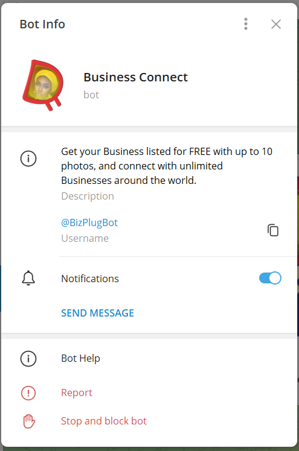
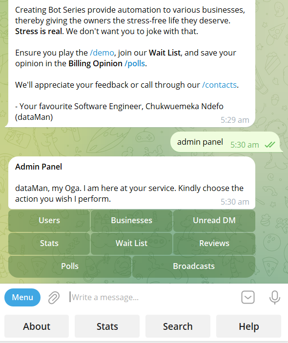
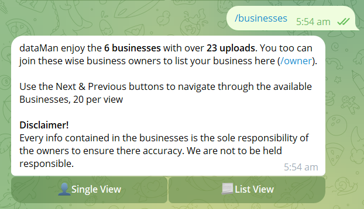
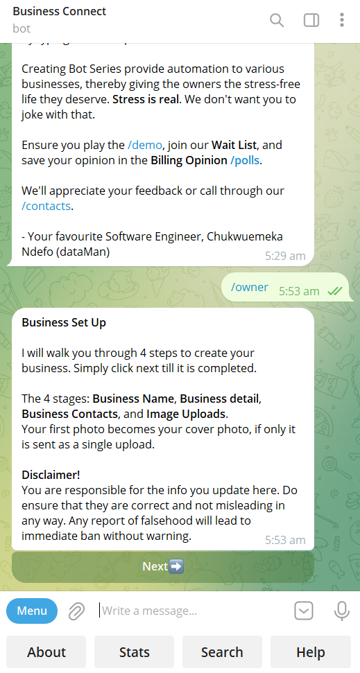
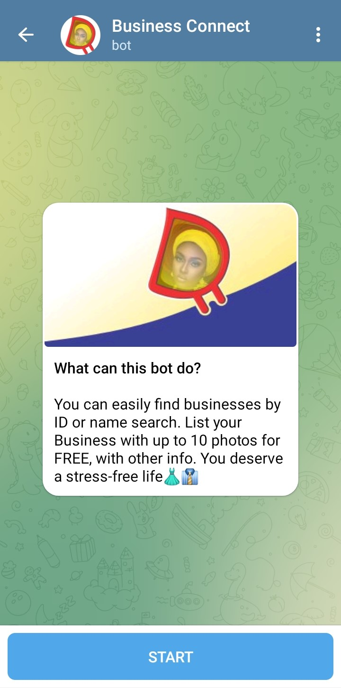
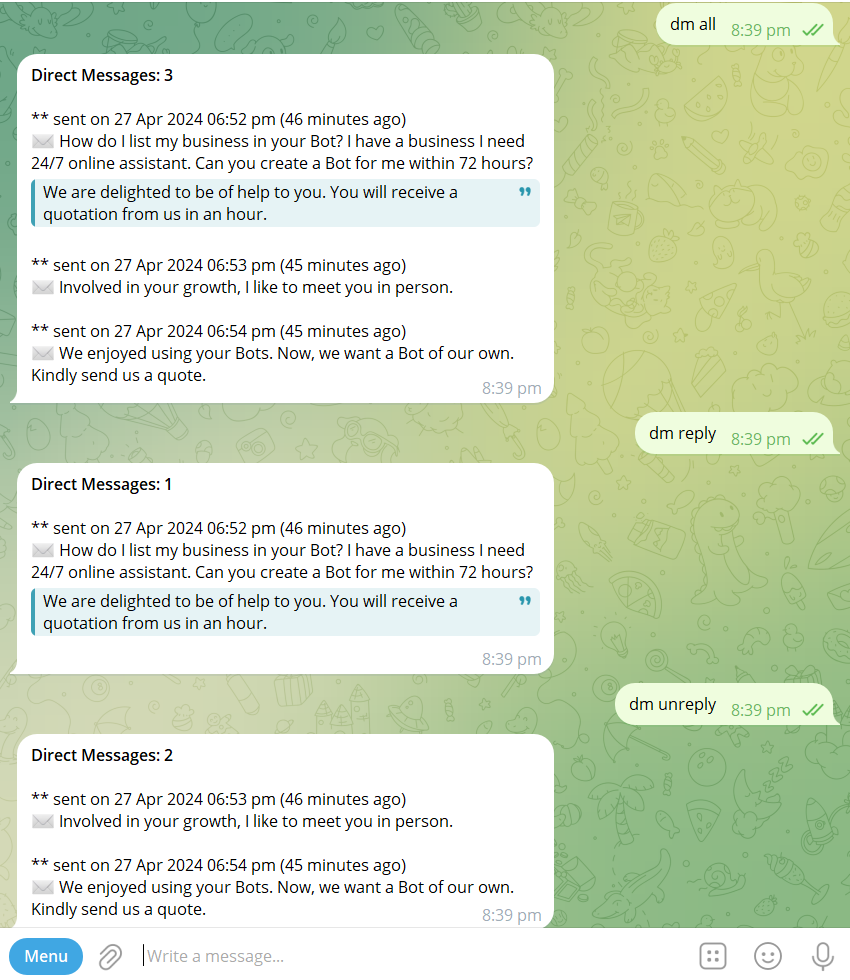
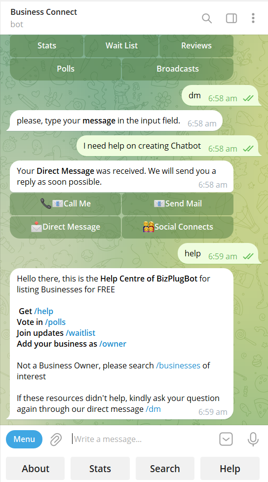
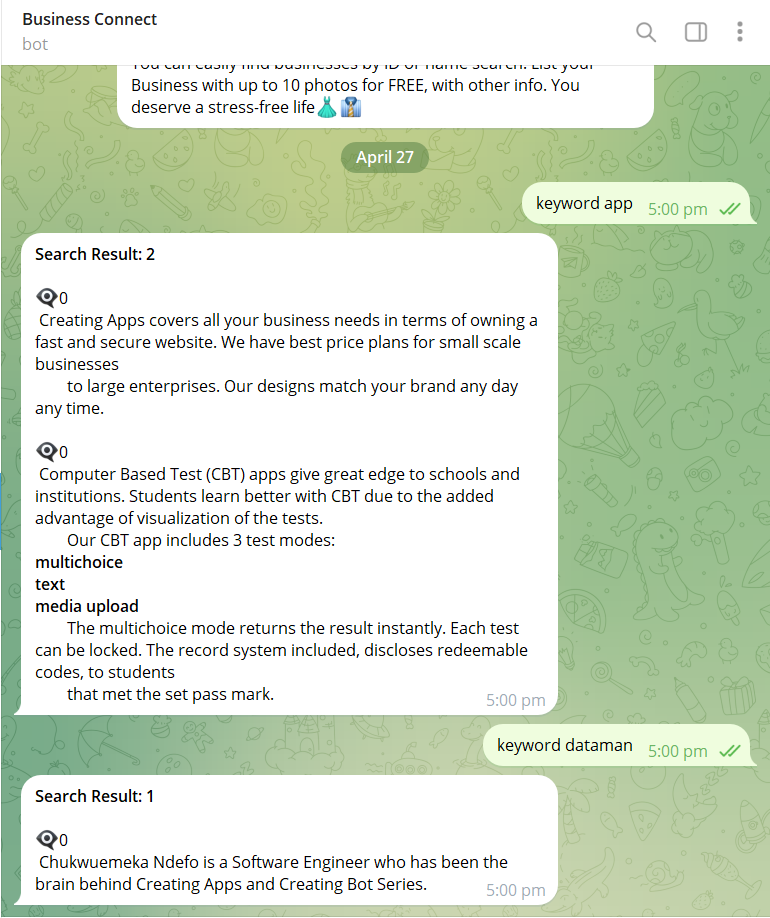

# business-telegram-bot
Chat Bot using Telegram API on Laravel backend, to collect info of Businesses and make them available to users by their name or IDs.

## The Problem
Small-scale business in Nigeria are finding it difficult to organize their contact details and products as well into one single place their customers can quickly refer to, in order to reach them.

## The Set-up
I used Laravel with Telegram API to create a back-end for a telegram bot, since many users are on Telegram. The Bot talks to the Api using pre-defined commands. Each command has unique action and response it produces. The Telegram API was deployed on a shared server which gives relatively fast responses.

## The Development
The Bot was first created to test out the Telegram API. I found out that Laravel can sync well with the API. Although, botman, the first API I used was a beat rigid in manupulating into exactly what I wanted. The idea to transform it into a useful app for the public was born. So, on 25th April, 2024, it was rebranded from it former name Test Dataman Bot. Due to the need for a wider use, I created custom commands to sync the API with Telegram app. I found an issue with users without username, which resulted to empty data that are relevant to the Bot.

## JSON Responses
```
array (
  'update_id' => xyz32xyz9,
  'message' => 
  array (
    'message_id' => 69,
    'from' => 
    array (
      'id' => 3xyz789275,
      'is_bot' => false,
      'first_name' => 'metaverse',
      'username' => 'metaverseuser',
      'language_code' => 'en',
    ),
    'chat' => 
    array (
      'id' => 3xyz789275,
      'first_name' => 'metaverse',
      'username' => 'metaverseuser',
      'type' => 'private',
    ),
    'date' => 1722643528,
    'reply_to_message' => 
    array (
      'message_id' => 68,
      'from' => 
      array (
        'id' => 7201922302,
        'is_bot' => true,
        'first_name' => '💂‍♀️Guard My Angels',
        'username' => 'guardmyangelsbot',
      ),
      'chat' => 
      array (
        'id' => 3xyz789275,
        'first_name' => 'metaverse',
        'username' => 'metaverseuser',
        'type' => 'private',
      ),
      'date' => 1722643507,
      'text' => 'Your 📲Phone Number is required. Kindly click the button below',
      'entities' => 
      array (
        0 => 
        array (
          'offset' => 5,
          'length' => 14,
          'type' => 'bold',
        ),
      ),
    ),
    'contact' => 
    array (
      'phone_number' => '2348037097898',
      'first_name' => 'metaverse',
      'user_id' => 3xyz789275,
    ),
  ),
)  
```

## Screanshots


















## Summary
Business Owners can now use the app to connect with their customers, where users can easily find their businesses by assigned IDs or business name. This Bot which was Created on 4th April, 2024, deployed on 22nd April, 2024 is yet to receive the adequate push for more businesses to enlist on it. I am hopeful that more users will find it helpful.

You may interact with the bot on 

